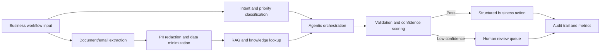

# Architecture Overview

This repository collects sanitized enterprise AI/ML case-study patterns and small runnable proof-of-concept modules. It is intentionally not client source code. The goal is to show architecture judgment, production tradeoffs, and interview-defensible implementation patterns.

## Reference Flow

## Design Principles

- Keep examples sanitized and portable.
- Separate case-study narrative from runnable demonstration code.
- Make confidence thresholds explicit so low-certainty output can route to review.
- Prefer deterministic validation around LLM output.
- Treat AI decisions as auditable workflow steps, not invisible magic.

## Enterprise Patterns Represented

- Event-driven intake and asynchronous processing.
- Agentic orchestration with validation gates.
- RAG evaluation and retrieval-quality checks.
- PII redaction before downstream LLM or logging steps.
- Idempotent workflow processing with safe retry patterns.
- Human-in-the-loop review for low-confidence outputs.

## Extension Points

- Replace local demo retrieval with Azure AI Search, PostgreSQL/pgvector, or another vector store.
- Replace mock LLM output with Azure OpenAI or an approved open-source model.
- Add organization-specific schemas, rules, and approval policies.
- Send metrics to a real observability stack such as Azure Monitor, OpenTelemetry, or Datadog.
